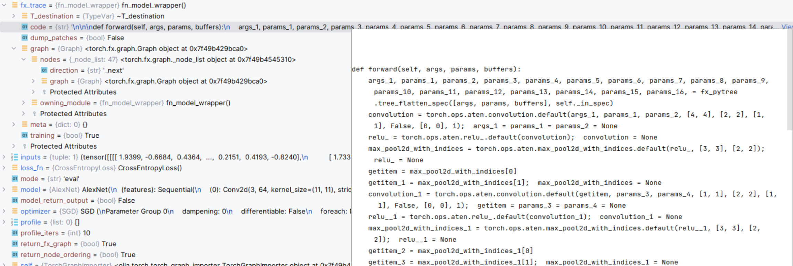

## benchmarks.py主要调用顺序

### main

`args`接收命令行输入  
实例化一个`Benchmark`类型`b`  
遍历`BENCHMARKS`中的神经网络`model,mode,batch_size`:  
定义一个`OrderedDict`类型`result`存放迭代信息  
给`device，profile,warm_up_iters,profile_iters`赋值  
`b`调用`load_model`方法，得到df图信息，fx图信息，模型以及输入样例  
判断是否预训练测试显存占用状况，打印显存碎片信息，缓存区大小及真实分配大小  
`b`调用`run_simulation`方法，得到预估峰值占用  
调用`run_node_ordering`方法，得到优化后的节点顺序，显存占用峰值，以及优化时间

### `load_model`方法
  
入参：模型名，执行模式，批量大小，设备名，`profile`记录预处理开关的列表，`warm_up_iters`预热轮次，`profile_iters`预训练轮次，`render_model=False`是否打印模型，`infer_trace=False`推断追踪   
`(a,)`定义一个一元组，必须加逗号  
`torch.concat(tuple,dim)`按维度合并元组中的张量
首先根据模型名，加载神经网络模型到`model`，定义模型输入样例`inputs`  
判断`mode`和`device`，决定执行模式和数据存储位置  
定义优化器`optimizer`选用SGD  
创建一个`TorchGraphImporter`实例`importer`，并调用`import_via_aotautograd`方法，同时损失函数`loss_fn`选用`torch.nn.CrossEntropyLoss()`，返回df图`g`，df图节点顺序，fx的`GraphModule`，df与fx图之间的节点映射  
然后给`g`命名，调用`canonicalize`将df图中边的类型标准化。随后提前图中参数更新操作，更早地释放梯度。同时延后张量的生成，但这一步没有生效  

返回 df图，fx图，模型输入输出

### `import_via_aotautograd`方法

主要入参:`model`是继承自`nn.Model`的各个网络模型的实例，`*inputs`是一个用元组包装的模型输入样例  
**wrapper装饰器**：本质上是一个函数，可让其他函数在不需要改代码的前提下增加额外功能，返回值也是一个函数对象  
定义了一个函数`fn_model_wrapper`，该函数将样例输入网络，模拟运行一遍神经网络
定义了`fx_trace`，调用`make_fx`包装了函数`fn_model_wrapper`，返回的是函数对象`fn_model_wrapper`，拥有属性`code`和`graph`，可以看作是`fx.GraphModule`类型。详见下图

最后返回调用了`self.import_from_fx`方法

### `import_from_fx`方法

主要入参：`fx_trace`一个函数对象，`*inputs`接收了模型输入样例以及模型参数的值，是一个长度为（1+模型参数数量）的元组  
`self.fx_trace = fx_trace`使得外部可以调用`fx_trace`，这个`self`就是`importer`  
从`fx_trace`取出`graph`赋值给`fx_graph`，是一个`torch.fx.graph.Graph`类型，里面有两个属性`nodes`和`owning_module`，前者是由各个节点组成的列表，后者是这个图所属的模块  

创建一个数据流图（df）的实例`df_graph`，调用了`dataflow_graph.Graph()`  
**创建df节点**：遍历`fx_graph.nodes`中的节点，将模型参数的节点类型名称改为`weight`，调用数据流图的`add_node`方法将非`output`节点依次加入到`df_graph`的字典类型属性`nodes`中，键为节点名称，值为数据流图定义的节点类型，同时会返回这个节点类型。定义了一个空字典`fx2df_node_map`，键为fx节点类型，值为df节点类型，做一个**映射**  

**创建df边**：再次遍历`fx_graph.nodes`中的节点`fx_node`，读取节点`meta`信息（记录张量的shape，dtype等信息），调用自定义的`get_size`方法算出节点占用的bytes赋值给`size`。判断`fx_node`是否在映射中，从映射中取出对应的`df_node`，判断其是否是模型参数，将`size`赋值给它并置0。遍历它的使用节点`fx_sink`（调用`fx_node.users.keys()`函数），如果这些节点在映射中，加入到`df_sinks`列表中。`df_sinks`不为空即代表节点有使用者，调用`add_edge`方法在图中加入有向边。需要注意的是，除了模型参数，`size`都被赋予了边。

调用了`_cleanup_dataflow_graph`方法，入参为上面生成的df图，该方法会删除没有入边和出边的参数节点，删除输入边大小为0的`getitem`方法节点，删除`relu`，`t`等in-place操作节点，将偏置参数合并到权重参数节点中。 

返回 df图，df图节点顺序，fx处理后的模型，fx与df的节点映射

### `dataflow_graph.Graph()`数据流图类
初始化函数：字符串name，字典nodes和deges
定义了一些列对节点和边的操作  
`add_node`方法：传入节点名`name`和节点类型`op_type`。用节点名作为键，用入参实例化df的`Node`类型作为值，插入df的`nodes`中，返回`self.nodes[name]`  
`add_edge`方法：入参有`sources`开始节点列表，`sinks`结束节点列表，`size`开始节点的大小，`name`边的名字“节点名:0”。用入参创建`MultiSourceEdge`类型实例`edge`作为值，`name`为键，加入到df的字典`edges`中。对于`sources`中的节点，将边加入到输出边集合`fanout`中；`sinks`中的节点，将边加入到输入边集合`fanin`中。

### `run_simulation`方法

入参：df图和节点顺序  
创建了一个`Simulator`类型实例`s`并将df图赋值给它作为私有属性，并对创建时间计时。调用了`Simulate`方法，得到预估显存峰值以及列表`mem_per_timestep`，列表中记录使显存峰值增加的节点与递增的显存峰值组成的元组。  
返回 预估显存峰值，实例化`s`的时间

**`Simulate`方法**：  
入参是节点顺序  
`defaultdict(lambda: 0)`定义一个默认 值为0的字典（值为int类型），lambda冒号后面是函数返回值。初始化一个默认字典用来记录张量引用次数  
初始化`memory_used`记录当前显存使用  
遍历每个节：  
对节点输出的每个张量，记录其被引用次数，为其分配显存，显存占用增加  
比较显存占用与峰值占用，更新峰值占用，并将节点和显存占用作为元组加入到`mem_per_timestep`列表  
对节点的每个输入，将其被引次数减1，被引次数不能小于0。如果被引次数归零，释放，显存占用减少  
返回显存峰值和`mem_per_timestep`列表

## `run_node_ordering`方法

入参：df图，fx包装的模型，fx与df节点映射  
初始化一个`Scheduler`实例`s`，调用了`ComputeOptimalSchedule`方法

**`ComputeOptimalSchedule`方法**：  
入参传进来一个系统最大值`mem_limit`，还有一些布尔类型的值  
调用自身`Scheduler`类的`ComputeMinimumMemoryRequired`方法，该方法计算df图中所有节点所需的显存占用（输入+输出边的大小），并返回显存占用最大的节点和值`bottleneck_node，min_memory_requirement`  
定义时间戳个数`num_timesteps`，根据之前计算的每个节点的计算等级，将（最高等级+1）的赋值给时间戳，表示网络模型可以在这么多时间戳内完成，一个时间戳可以运行一个或并行运行多个计算节点。  
定义`asap`和`alap`，分别得到节点最早和最晚执行时间戳字典，定义`makspan`，调用`ComputeMakespans`得到节点的最早使用时间戳和最晚释放时间戳  
定义`max_address`，表示最大的逻辑地址  
`generate_vars[e][t]`表示在`t`时刻是否为张量`e`分配显存  
`preserve_vars[e][t]`表示在`t`时刻张量`e`是否存储在显存中  
在求解器中加入各种限制条件，加入目标函数，得到以上两个变量的值